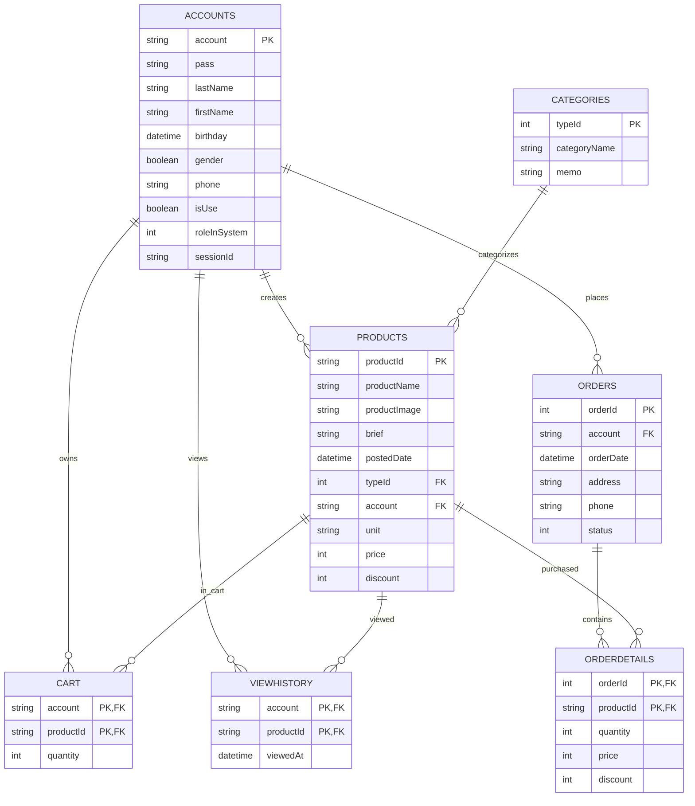

# Project Overview

## 1. Project Summary

This repository contains a Java Servlet/JSP e-commerce web application for browsing products, viewing product details, managing a shopping cart, checking out, reviewing order history, and administering products, categories, accounts, and orders.

The application appears to be a PRJ301 workshop/student project. Its target users are:

- Public shoppers who browse/search/filter products.
- Logged-in customers who maintain carts, check out, and view their order history.
- Staff users who manage products and categories.
- Administrators who manage accounts and all orders.

### Tech Stack

| Area | Technology |
| --- | --- |
| Language | Java, JSP, SQL, HTML, CSS, JavaScript |
| Java version | Java 8 source/target (`javac.source=1.8`, `javac.target=1.8`) |
| Web framework | Java Servlet API 3.1, JSP, JSTL 1.2 |
| Server | Apache Tomcat 9 |
| Persistence | JDBC with DAO classes |
| Primary database runtime | Microsoft SQL Server / SQL Server Express |
| JDBC driver | `mssql-jdbc-13.4.0.jre8.jar` plus optional `mssql-jdbc_auth-13.4.0.x64.dll` for Windows Authentication |
| Build tooling | NetBeans Ant project (`build.xml`, `nbproject/*`) |
| Deployment tooling | Dockerfile, Railway config, optional Docker Compose |
| Frontend libraries | Bootstrap 4, jQuery, Font Awesome, JSTL formatting tags |
| Bundled/static frontend assets | Bootstrap, jQuery UI, Owl Carousel, PrettyPhoto, custom CSS/JS |

Important database note: the current Java code and README are SQL Server oriented, but `docker-compose.yml` still provisions MySQL and `db/init.sql` is a MySQL schema. There is also at least one DAO method that still uses MySQL-specific SQL. See "Known Issues / TODOs".

## 2. Folder & File Structure

Key project structure, excluding generated build outputs (`build/`, `dist/`) and binary/static details:

```text
.
|-- .env.example
|-- README.md
|-- PROJECT_OVERVIEW.md
|-- build.xml
|-- Dockerfile
|-- docker-compose.yml
|-- railway.json
|-- ProductIntro_WS2_ThangNDC_SE203709.sql
|-- ProductIntro_WS2_ThangNDC_SE203709_sqlserver.sql
|-- db/
|   |-- init.sql
|   |-- ProductIntro_WS2_ThangNDC_SE203709_sqlserver.sql
|   `-- translate-current-data-to-english.sql
|-- docker/
|   `-- start-tomcat.sh
|-- nbproject/
|   |-- project.xml
|   |-- project.properties
|   |-- build-impl.xml
|   |-- ant-deploy.xml
|   `-- genfiles.properties
|-- src/
|   |-- conf/
|   |   `-- MANIFEST.MF
|   `-- java/
|       |-- controller/
|       |   |-- MainController.java
|       |   |-- account/
|       |   |-- cart/
|       |   |-- category/
|       |   |-- home/
|       |   |-- product/
|       |   `-- search/
|       |-- filter/
|       |-- model/
|       |   |-- Account.java
|       |   |-- Category.java
|       |   |-- Product.java
|       |   |-- Order.java
|       |   |-- OrderDetail.java
|       |   `-- dao/
|       `-- util/
|           `-- ConnectDB.java
|-- test/
`-- web/
    |-- Home.jsp
    |-- Login.jsp
    |-- error.jsp
    |-- Common/
    |-- private/
    |   |-- Account/
    |   |-- Cart/
    |   |-- Category/
    |   |-- Order/
    |   `-- Product/
    |-- public/
    |   |-- Category/
    |   |-- Product/
    |   `-- Detail.jsp
    |-- WEB-INF/
    |   |-- web.xml
    |   |-- glassfish-web.xml
    |   `-- lib/
    |-- META-INF/
    |-- css/
    |-- js/
    |-- images/
    |-- font-awesome/
    `-- fonts/
```

### Major Folders and Files

| Path | Responsibility |
| --- | --- |
| `src/java/controller` | Servlet controllers. Each controller handles one route or module action and forwards to JSPs or redirects after mutations. |
| `src/java/controller/home` | Public browsing, login/logout, category/detail pages. |
| `src/java/controller/cart` | Cart display/actions, checkout, customer order history. |
| `src/java/controller/account` | Admin account management and admin order management. |
| `src/java/controller/category` | Staff/admin category CRUD. |
| `src/java/controller/product` | Staff/admin product CRUD. |
| `src/java/controller/search` | Product search route. |
| `src/java/filter` | Servlet filters/listener for login authorization and duplicate-session management. |
| `src/java/model` | JavaBean-style domain models used by controllers, DAOs, and JSP expression language. |
| `src/java/model/dao` | Raw JDBC data-access classes for accounts, products, categories, cart, view history, and orders. |
| `src/java/util/ConnectDB.java` | SQL Server connection configuration, JDBC URL creation, auth DLL loading, and connection error tracking. |
| `web/*.jsp` | Top-level JSP pages for home, login, and error display. |
| `web/Common` | Shared JSP fragments: navigation menu, left sidebar, footer. |
| `web/public` | Public/listing JSPs for products, product detail, and category management listing. |
| `web/private` | Authenticated/admin JSP pages for forms, cart, checkout, order history, account/order management. |
| `web/WEB-INF/web.xml` | Servlet 3.1 deployment descriptor, session timeout, and welcome route. |
| `web/WEB-INF/lib` | Bundled JARs and SQL Server native auth DLL. |
| `web/META-INF/context.xml` | Tomcat context path `/WS_2`. |
| `web/META-INF/context_1.xml` | Older/stale context path `/Workshop1`. |
| `web/css`, `web/js`, `web/images` | Styling, JavaScript, product images, logo, and banners. |
| `db/ProductIntro_WS2_ThangNDC_SE203709_sqlserver.sql` | SQL Server database creation, schema, and seed data. |
| `db/init.sql` | MySQL schema and seed data used by Docker Compose. |
| `db/translate-current-data-to-english.sql` | SQL Server data update script for English product/category names. |
| `ProductIntro_WS2_ThangNDC_SE203709.sql` | Root MySQL script with database creation wrapper. |
| `ProductIntro_WS2_ThangNDC_SE203709_sqlserver.sql` | Root SQL Server script duplicate of the SQL Server schema. |
| `build.xml`, `nbproject/*` | NetBeans/Ant web project metadata and build/deploy scripts. |
| `Dockerfile` | Multi-stage Tomcat build that compiles Java and packages `ROOT.war`. |
| `docker/start-tomcat.sh` | Reads `PORT` and rewrites Tomcat's HTTP connector before startup. |
| `.env.example` | Template for database and Tomcat environment variables. |
| `test/` | Test source root configured by NetBeans; currently empty. |

## 3. Architecture

### Overall Pattern

The application follows a simple MVC/layered Java web architecture:

```text
Browser
  -> Servlet Filter(s)
  -> @WebServlet Controller
  -> DAO
  -> JDBC Connection
  -> SQL Server database
  -> Controller request attributes/session attributes
  -> JSP view
  -> HTML response
```

Layers:

- View layer: JSP pages in `web/`, using JSTL and JSP EL.
- Controller layer: `HttpServlet` subclasses in `src/java/controller`.
- Model layer: JavaBean domain classes in `src/java/model`.
- Data access layer: DAO classes in `src/java/model/dao`.
- Infrastructure layer: filters/listeners in `src/java/filter` and database connection utility in `src/java/util`.

There is no dedicated service layer. Controllers instantiate DAOs directly and perform business logic inline.

### Request Flow Examples

Home/catalog request:

```text
GET /home
  -> SessionFilter
  -> HomeController
  -> ProductDAO.listWithFilter(...)
  -> CategoryDAO.listAll()
  -> ProductDAO.getLast()
  -> request attributes: listP, listC, last, viewedProductList, dbError
  -> /Home.jsp
  -> includes /Common/Menu.jsp, /Common/Left.jsp, /Common/Footer.jsp
```

Login request:

```text
POST /login
  -> LoginController
  -> AccountDAO.getObjectById(user)
  -> compare submitted password with accounts.pass
  -> load saved cart via CartDAO
  -> load view history via ViewHistoryDAO
  -> session attributes: acc, cart, viewedProducts, userSegment
  -> redirect to saved redirectUrl or /home
```

Admin product management:

```text
GET/POST /manageProduct...
  -> SessionFilter
  -> LoginFilter
  -> Product*Controller
  -> ProductDAO / CategoryDAO / OrderDAO
  -> JSP form/listing or redirect
```

Checkout:

```text
POST /checkout
  -> CheckoutController
  -> OrderDAO.createOrder(...)
  -> INSERT orders
  -> INSERT orderdetails
  -> clear session cart and persisted cart
  -> redirect /orderHistory?success=1
```

### Key Design Patterns

| Pattern | Where Used | Notes |
| --- | --- | --- |
| MVC | Controllers, JSPs, models | Controllers route requests, DAOs fetch data, JSPs render views. |
| DAO | `AccountDAO`, `ProductDAO`, `CategoryDAO`, `CartDAO`, `OrderDAO`, `ViewHistoryDAO` | Raw JDBC SQL is isolated from controllers. |
| JavaBean/POJO | `Account`, `Category`, `Product`, `Order`, `OrderDetail` | Beans expose getters/setters for JSP EL. |
| Filter/interceptor | `LoginFilter`, `SessionFilter` | Cross-cutting auth/session checks run before servlets. |
| Listener/session registry | `SessionManageListener` | Tracks active sessions by account and invalidates previous sessions. |
| PRG (Post/Redirect/Get) | Most create/update/delete actions | Mutations usually redirect to listing pages after success. |
| Generic CRUD interface | `Accessible<T>` | Shared DAO shape for insert/update/delete/get/list. |

## 4. Database Schema

The schema below uses the SQL Server script (`db/ProductIntro_WS2_ThangNDC_SE203709_sqlserver.sql`) because the current Java connection utility uses `com.microsoft.sqlserver.jdbc.SQLServerDriver`.

### Tables

#### `accounts`

| Column | Type | Key/Constraint | Notes |
| --- | --- | --- | --- |
| `account` | `NVARCHAR(20)` | PK, NOT NULL | Login/user id. |
| `pass` | `NVARCHAR(20)` | NOT NULL | Plaintext password in current code. |
| `lastName` | `NVARCHAR(50)` | NULL | Last name. |
| `firstName` | `NVARCHAR(30)` | NOT NULL | First name. |
| `birthday` | `DATETIME2` | NULL | Date of birth. |
| `gender` | `BIT` | DEFAULT 1 | `true`/`1` is displayed as Male. |
| `phone` | `NVARCHAR(20)` | NULL | Phone number. |
| `isUse` | `BIT` | DEFAULT 0 | Account active/deactivated flag. |
| `roleInSystem` | `INT` | DEFAULT 0 | `1` admin, `2` staff, `0` customer. |
| `sessionId` | `NVARCHAR(128)` | NULL | Present in schema; mostly unused by current controllers. |

Seed accounts:

- `admin` / `abc`, role `1` administrator.
- `manager` / `123`, role `2` staff.

#### `categories`

| Column | Type | Key/Constraint | Notes |
| --- | --- | --- | --- |
| `typeId` | `INT IDENTITY(1,1)` | PK, NOT NULL | Category id. |
| `categoryName` | `NVARCHAR(88)` | NOT NULL | Display name. |
| `memo` | `NVARCHAR(MAX)` | DEFAULT NULL | Optional description/memo. |

Seed categories:

- Kitchenware
- Home Appliances
- Home Decor
- Fitness Equipment
- Smart Devices
- Fashion Apparel

#### `products`

| Column | Type | Key/Constraint | Notes |
| --- | --- | --- | --- |
| `productId` | `NVARCHAR(10)` | PK, NOT NULL | Product id/code. |
| `productName` | `NVARCHAR(500)` | NOT NULL | Product display name. |
| `productImage` | `NVARCHAR(MAX)` | NULL | Image path under `web/images`. |
| `brief` | `NVARCHAR(MAX)` | NULL | Description. |
| `postedDate` | `DATETIME2` | DEFAULT CURRENT_TIMESTAMP | Creation/post date. |
| `typeId` | `INT` | FK -> `categories(typeId)`, NOT NULL | Product category. |
| `account` | `NVARCHAR(20)` | FK -> `accounts(account)` ON UPDATE CASCADE, NOT NULL | Account that created/listed the product. |
| `unit` | `NVARCHAR(32)` | DEFAULT `pcs` | Unit label. |
| `price` | `INT` | DEFAULT 0 | Price in VND. |
| `discount` | `INT` | DEFAULT 0, CHECK 0-100 | Discount percent. |

#### `cart`

| Column | Type | Key/Constraint | Notes |
| --- | --- | --- | --- |
| `account` | `NVARCHAR(20)` | PK part, FK -> `accounts(account)` ON DELETE CASCADE | Cart owner. |
| `productId` | `NVARCHAR(10)` | PK part, FK -> `products(productId)` ON DELETE CASCADE | Cart item. |
| `quantity` | `INT` | DEFAULT 1 | Item quantity. |

Composite primary key: (`account`, `productId`).

#### `viewhistory`

| Column | Type | Key/Constraint | Notes |
| --- | --- | --- | --- |
| `account` | `NVARCHAR(20)` | PK part, FK -> `accounts(account)` ON DELETE CASCADE | Viewer. |
| `productId` | `NVARCHAR(10)` | PK part, FK -> `products(productId)` ON DELETE CASCADE | Viewed product. |
| `viewedAt` | `DATETIME2` | DEFAULT CURRENT_TIMESTAMP | Latest view timestamp. |

Composite primary key: (`account`, `productId`).

#### `orders`

| Column | Type | Key/Constraint | Notes |
| --- | --- | --- | --- |
| `orderId` | `INT IDENTITY(1,1)` | PK, NOT NULL | Order id. |
| `account` | `NVARCHAR(20)` | FK -> `accounts(account)`, NULL | Customer account. |
| `orderDate` | `DATETIME2` | DEFAULT CURRENT_TIMESTAMP | Order time. |
| `address` | `NVARCHAR(500)` | NOT NULL | Shipping address. |
| `phone` | `NVARCHAR(20)` | NOT NULL | Shipping phone. |
| `status` | `INT` | DEFAULT 0 | `0` pending, `1` shipping, `2` completed, `3` canceled. |

#### `orderdetails`

| Column | Type | Key/Constraint | Notes |
| --- | --- | --- | --- |
| `orderId` | `INT` | PK part, FK -> `orders(orderId)` ON DELETE CASCADE, NOT NULL | Parent order. |
| `productId` | `NVARCHAR(10)` | PK part, FK -> `products(productId)`, NOT NULL | Purchased product. |
| `quantity` | `INT` | NOT NULL | Quantity purchased. |
| `price` | `INT` | NOT NULL | Product price snapshot at checkout. |
| `discount` | `INT` | DEFAULT 0 | Discount snapshot at checkout. |

Composite primary key: (`orderId`, `productId`).

### Relationships

| Relationship | Cardinality | Implemented By |
| --- | --- | --- |
| Account creates/products | 1 account -> many products | `products.account` FK |
| Category contains products | 1 category -> many products | `products.typeId` FK |
| Account owns saved cart items | 1 account -> many cart rows | `cart.account` FK |
| Product appears in saved carts | 1 product -> many cart rows | `cart.productId` FK |
| Account has view history | 1 account -> many viewhistory rows | `viewhistory.account` FK |
| Product appears in view history | 1 product -> many viewhistory rows | `viewhistory.productId` FK |
| Account places orders | 1 account -> many orders | `orders.account` FK |
| Order has details | 1 order -> many orderdetails rows | `orderdetails.orderId` FK |
| Product appears in order details | 1 product -> many orderdetails rows | `orderdetails.productId` FK |

### ER Diagram

The exact SQL data types are listed in the tables above; this Mermaid diagram keeps types short for parser compatibility.



## 5. Key Features / Modules

### Product Catalog and Home Page

Purpose:

- Show product listings.
- Filter by category, price range, and discount.
- Sort by price.
- Show latest product and recently viewed products.

Main files:

- `src/java/controller/home/HomeController.java`
- `src/java/controller/home/CategoryController.java`
- `src/java/model/dao/ProductDAO.java`
- `src/java/model/dao/CategoryDAO.java`
- `web/Home.jsp`
- `web/Common/Left.jsp`

### Product Detail and Recently Viewed History

Purpose:

- Show a single product detail page.
- Track recently viewed products in the HTTP session.
- Persist view history for logged-in users.
- Calculate a basic customer segment based on average viewed product price.

Main files:

- `src/java/controller/home/DetailController.java`
- `src/java/model/dao/ProductDAO.java`
- `src/java/model/dao/ViewHistoryDAO.java`
- `web/public/Detail.jsp`
- `web/Common/Left.jsp`

### Authentication and Session Management

Purpose:

- Login and logout.
- Limit failed login attempts per session.
- Load persisted cart and view history on login.
- Prevent duplicate active sessions by account.

Main files:

- `src/java/controller/home/LoginController.java`
- `src/java/controller/home/LogoutController.java`
- `src/java/filter/LoginFilter.java`
- `src/java/filter/SessionFilter.java`
- `src/java/filter/SessionManageListener.java`
- `src/java/model/dao/AccountDAO.java`
- `src/java/model/dao/CartDAO.java`
- `src/java/model/dao/ViewHistoryDAO.java`
- `web/Login.jsp`
- `web/Common/Menu.jsp`

### Cart

Purpose:

- Add/buy-now product actions.
- Increase, decrease, and remove quantities.
- Display totals with discounts.
- Persist a logged-in user's cart on logout and clear it after checkout.

Main files:

- `src/java/controller/cart/CartController.java`
- `src/java/model/dao/CartDAO.java`
- `src/java/model/dao/ProductDAO.java`
- `web/private/Cart/Cart.jsp`
- `web/public/Detail.jsp`

### Checkout and Customer Order History

Purpose:

- Confirm shipping phone/address.
- Create orders and order detail rows.
- Display logged-in customer's order list and detail view.

Main files:

- `src/java/controller/cart/CheckoutController.java`
- `src/java/controller/cart/OrderHistoryController.java`
- `src/java/model/dao/OrderDAO.java`
- `src/java/model/Order.java`
- `src/java/model/OrderDetail.java`
- `web/private/Cart/Checkout.jsp`
- `web/private/Order/OrderHistory.jsp`

### Account Management

Purpose:

- Admin-only list, filter, add, update, delete, activate/deactivate accounts.
- Display user segmentation derived from view history.
- Protect last active admin in some flows.

Main files:

- `src/java/controller/account/AccountShowController.java`
- `src/java/controller/account/AccountAddController.java`
- `src/java/controller/account/AccountUpdateController.java`
- `src/java/controller/account/AccountDeleteController.java`
- `src/java/controller/account/AccountToggleUseController.java`
- `src/java/filter/LoginFilter.java`
- `src/java/model/dao/AccountDAO.java`
- `src/java/model/dao/ViewHistoryDAO.java`
- `web/private/Account/Account.jsp`
- `web/private/Account/addAccount.jsp`
- `web/private/Account/updateAccount.jsp`

### Product Management

Purpose:

- Staff/admin product CRUD.
- Prevent product deletion if order details reference the product.

Main files:

- `src/java/controller/product/ProductShowController.java`
- `src/java/controller/product/ProductAddController.java`
- `src/java/controller/product/ProductUpdateController.java`
- `src/java/controller/product/ProductDeleteController.java`
- `src/java/model/dao/ProductDAO.java`
- `src/java/model/dao/OrderDAO.java`
- `web/public/Product/Product.jsp`
- `web/private/Product/addProduct.jsp`
- `web/private/Product/updateProduct.jsp`

### Category Management

Purpose:

- Staff/admin category CRUD.
- Prevent category deletion when products still reference it.

Main files:

- `src/java/controller/category/CategoryShowController.java`
- `src/java/controller/category/CategoryAddController.java`
- `src/java/controller/category/CategoryUpdateController.java`
- `src/java/controller/category/CategoryDeleteController.java`
- `src/java/model/dao/CategoryDAO.java`
- `src/java/model/dao/ProductDAO.java`
- `web/public/Category/Category.jsp`
- `web/private/Category/addCategory.jsp`
- `web/private/Category/updateCategory.jsp`

### Admin Order Management

Purpose:

- Admin-only list of all orders.
- View order details.
- Update order status.

Main files:

- `src/java/controller/account/OrderManageController.java`
- `src/java/model/dao/OrderDAO.java`
- `web/private/Account/OrderManage.jsp`

### Search

Purpose:

- Search products by product name.

Main files:

- `src/java/controller/search/SearchController.java`
- `src/java/model/dao/ProductDAO.java`
- `web/Common/Menu.jsp`
- `web/Home.jsp`

## 6. API / Routes

This is a server-rendered application, not a JSON API. Routes are servlet endpoints that render JSPs or redirect after form actions.

Most servlets implement both `doGet` and `doPost`, but the practical method shown below follows the code and JSP forms.

| Route | Practical Method(s) | Controller | Access | Purpose |
| --- | --- | --- | --- | --- |
| `/home` | GET, POST | `HomeController` | Public | Product catalog with filters/sorting. Welcome route in `web.xml`. |
| `/category?typeId=...` | GET, POST | `CategoryController` | Public | Category-filtered catalog page. Mostly superseded by `/home?typeId=...`. |
| `/detail?productId=...` | GET, POST | `DetailController` | Public | Product detail page and recently viewed tracking. |
| `/search` | POST, GET | `SearchController` | Public | Product-name search. |
| `/login` | GET | `LoginController` | Public | Render login form. |
| `/login` | POST | `LoginController` | Public | Authenticate and initialize session state. |
| `/logout` | GET, POST | `LogoutController` | Logged-in useful, public callable | Save cart, invalidate session, redirect home. |
| `/cart` | GET | `CartController` | Public display; add/buy requires login | Show cart. |
| `/cart?action=add` | POST | `CartController` | Logged in | Add one product to cart. |
| `/cart?action=buyNow` | POST | `CartController` | Logged in | Add one product and redirect to checkout. |
| `/cart?action=remove` | POST | `CartController` | Session cart | Remove product from cart. |
| `/cart?action=increase` | POST | `CartController` | Session cart | Increment quantity. |
| `/cart?action=decrease` | POST | `CartController` | Session cart | Decrement quantity or remove when quantity reaches zero. |
| `/checkout` | GET | `CheckoutController` | Logged in | Render checkout form. |
| `/checkout` | POST | `CheckoutController` | Logged in | Create order and clear cart. |
| `/orderHistory` | GET, POST | `OrderHistoryController` | Logged in | Customer order history; optional `orderId` shows details. |
| `/account` | GET, POST | `AccountShowController` | Admin only via `LoginFilter` | Account list; optional `role` filter. |
| `/account/add` | GET | `AccountAddController` | Admin only | Render add-account form. |
| `/account/add` | POST | `AccountAddController` | Admin only | Create account. |
| `/account/update?id=...` | GET | `AccountUpdateController` | Admin only | Render update-account form. |
| `/account/update` | POST | `AccountUpdateController` | Admin only | Update account. |
| `/account/delete` | POST, GET | `AccountDeleteController` | Admin only | Delete account when it owns no products. |
| `/account/toggleUse` | POST, GET | `AccountToggleUseController` | Admin only | Activate/deactivate account. |
| `/account/orders` | GET | `OrderManageController` | Admin only | List all orders; optional `orderId` shows details. |
| `/account/orders` | POST | `OrderManageController` | Admin only | Update order status when `action=updateStatus`. |
| `/manageCategory` | GET, POST | `CategoryShowController` | Logged-in staff/admin | Category list. |
| `/manageCategory/add` | GET | `CategoryAddController` | Logged-in staff/admin | Render add-category form. |
| `/manageCategory/add` | POST | `CategoryAddController` | Logged-in staff/admin | Create category. |
| `/manageCategory/update?id=...` | GET | `CategoryUpdateController` | Logged-in staff/admin | Render update-category form. |
| `/manageCategory/update` | POST | `CategoryUpdateController` | Logged-in staff/admin | Update category. |
| `/manageCategory/delete` | POST, GET | `CategoryDeleteController` | Logged-in staff/admin | Delete category when no products reference it. |
| `/manageProduct` | GET, POST | `ProductShowController` | Logged-in staff/admin | Product list. |
| `/manageProduct/add` | GET | `ProductAddController` | Logged-in staff/admin | Render add-product form. |
| `/manageProduct/add` | POST | `ProductAddController` | Logged-in staff/admin | Create product. |
| `/manageProduct/update?id=...` | GET | `ProductUpdateController` | Logged-in staff/admin | Render update-product form. |
| `/manageProduct/update` | POST | `ProductUpdateController` | Logged-in staff/admin | Update product. |
| `/manageProduct/delete` | POST, GET | `ProductDeleteController` | Logged-in staff/admin | Delete product when no orders reference it. |
| `/MainController?action=account` | GET, POST | `MainController` | Legacy/public | Redirect to `/account`. |
| `/MainController?action=category` | GET, POST | `MainController` | Legacy/public | Redirect to `/manageCategory`. |
| `/MainController?action=product` | GET, POST | `MainController` | Legacy/public | Redirect to `/manageProduct`. |

### Filters and Listener

| Component | Scope | Behavior |
| --- | --- | --- |
| `SessionFilter` | `/*` | Detects a `kicked` session attribute and redirects to `/login?error=duplicate`. |
| `LoginFilter` | `/account/*`, `/account`, `/manageCategory/*`, `/manageCategory`, `/manageProduct/*`, `/manageProduct` | Requires `session.acc`; restricts `/account...` routes to `roleInSystem == 1`. |
| `SessionManageListener` | Servlet listener | Tracks active sessions by account and invalidates an older session when the same account logs in elsewhere. |

## 7. Setup & Run Instructions

### Prerequisites

- JDK 8 or newer. The Dockerfile uses JDK 17 but compiles with `-source 8 -target 8`.
- Apache Tomcat 9 if running locally outside Docker.
- NetBeans or Ant for the existing project workflow.
- Microsoft SQL Server or SQL Server Express reachable from the app.
- `sqlcmd` if importing SQL Server scripts from the command line.

### Environment Variables

The app reads database settings from environment variables in `ConnectDB`.

| Variable | Default | Purpose |
| --- | --- | --- |
| `DB_HOST` | `localhost` | SQL Server host. |
| `DB_PORT` | `1433` | SQL Server TCP port. |
| `DB_NAME` | `ProductIntro_WS2_ThangNDC_SE203709` | Database name. |
| `DB_INTEGRATED_SECURITY` | `true` when `DB_USER` is empty | Use Windows Authentication. |
| `DB_USER` | empty | SQL Server login for SQL Authentication. |
| `DB_PASSWORD` | empty | SQL Server password for SQL Authentication. |
| `MSSQL_JDBC_AUTH_PATH` | empty | Optional full path to `mssql-jdbc_auth-13.4.0.x64.dll`. |
| `PORT` | `8080` | Tomcat HTTP port used by Docker startup script. |

`.env.example` is a template. A normal Tomcat/NetBeans run will not automatically load it; configure these variables in the OS, IDE server settings, Tomcat service, or Docker environment.

### Database Setup - SQL Server

Use the SQL Server schema because the current Java code uses the SQL Server JDBC driver.

Windows Authentication example:

```powershell
sqlcmd -S tcp:localhost,1433 -E -C -f 65001 -i db\ProductIntro_WS2_ThangNDC_SE203709_sqlserver.sql
```

SQL Authentication example:

```powershell
sqlcmd -S tcp:localhost,1433 -U your_user -P your_password -C -f 65001 -i db\ProductIntro_WS2_ThangNDC_SE203709_sqlserver.sql
```

Optional data translation/update script:

```powershell
sqlcmd -S tcp:localhost,1433 -E -C -f 65001 -i db\translate-current-data-to-english.sql
```

The SQL Server script creates the database if missing, drops/recreates all application tables, and inserts seed accounts/categories/products.

### Run Locally with NetBeans / Tomcat

1. Install JDK 8+ and Tomcat 9.
2. Import the SQL Server database script above.
3. Confirm `web/WEB-INF/lib` contains `jstl-1.2.jar`, `mssql-jdbc-13.4.0.jre8.jar`, and, for Windows Authentication, `mssql-jdbc_auth-13.4.0.x64.dll`.
4. Configure environment variables or Tomcat VM options for database access.
5. Open the project in NetBeans.
6. Clean/build/deploy to Tomcat.
7. Open the app at the deployed context path. The local Tomcat context file sets `/WS_2`, so the URL is typically:

```text
http://localhost:8080/WS_2/home
```

If using the Dockerfile, the WAR is deployed as `ROOT.war`, so the URL is:

```text
http://localhost:8080/home
```

For Windows Authentication, if Tomcat reports that the driver is not configured for integrated authentication, set VM options similar to:

```text
-Djava.library.path=C:\Users\nguye\Downloads\WS_2_ThangNDC_SE203709\E-commerce\web\WEB-INF\lib
-DMSSQL_JDBC_AUTH_PATH=C:\Users\nguye\Downloads\WS_2_ThangNDC_SE203709\E-commerce\web\WEB-INF\lib\mssql-jdbc_auth-13.4.0.x64.dll
```

### Build with Ant

From the project root:

```powershell
ant clean dist
```

Expected output is a WAR under `dist/`, with the name configured by `nbproject/project.properties`:

```text
dist/WS2_ThangNDC_SE203709.war
```

### Build/Run with Docker

The Dockerfile can compile and package the app into Tomcat:

```powershell
docker build -t ecommerce-web .
docker run --rm -p 8080:8080 `
  -e DB_HOST=host.docker.internal `
  -e DB_PORT=1433 `
  -e DB_NAME=ProductIntro_WS2_ThangNDC_SE203709 `
  -e DB_INTEGRATED_SECURITY=false `
  -e DB_USER=your_user `
  -e DB_PASSWORD=your_password `
  ecommerce-web
```

Then open:

```text
http://localhost:8080/home
```

Do not assume `docker-compose.yml` currently provides a working end-to-end runtime. It starts MySQL, but the app now uses SQL Server JDBC.

## 8. Known Issues / TODOs

| Area | Issue |
| --- | --- |
| SQL dialect mismatch | `ConnectDB` and `ProductDAO.getLast()` use SQL Server (`SELECT TOP 1`), but `ViewHistoryDAO.saveView()` uses MySQL-only `ON DUPLICATE KEY UPDATE`. On SQL Server, saving view history will fail unless rewritten as `MERGE` or an update-then-insert pattern. |
| Docker Compose mismatch | `docker-compose.yml` provisions MySQL 8 and passes MySQL-style connection settings, but the app loads only the SQL Server driver. The deleted MySQL connector in git status confirms this is mid-migration. |
| Plaintext passwords | Passwords are stored and compared as plaintext (`accounts.pass`), with seed credentials `admin/abc` and `manager/123`. Use password hashing before production use. |
| Weak login throttling | Failed login count is stored in the session only and has no time-based reset path after 3 failures except creating a new session/browser. |
| Inconsistent transaction handling | `OrderDAO.createOrder()` inserts an order header and details without explicit commit/rollback control. `insertOrderDetails()` also calls `ProductDAO.getObjectById()`, which opens separate connections while using the original order connection for inserts. |
| Null connection handling | `ConnectDB.getConnection()` returns `null` on failure. DAOs immediately call `con.prepareStatement(...)`, causing `NullPointerException`s that are caught with `printStackTrace()` instead of clear user-facing errors. |
| No connection pooling | Every DAO call creates a new `ConnectDB` and `DriverManager` connection. A `DataSource`/pool would be more reliable under load. |
| Product add error forwarding | `ProductAddController` forwards validation failures to `/Product/addProduct.jsp`, but the real JSP is `/private/Product/addProduct.jsp`. |
| Missing parameter validation | Several controllers parse request parameters directly (`Integer.parseInt`, `Date.valueOf`, `txtSearch.trim()`) and can throw server errors on missing or malformed input. |
| Admin self-deactivation edge case | `AccountToggleUseController` prevents self-deactivation, but `AccountUpdateController` can still set `isUse=false` from the update form and does not check self/last-admin deactivation. |
| Role model is implicit | `roleInSystem` values are magic numbers spread through controllers/JSPs (`1`, `2`, `0`) instead of named constants/enums. |
| Service layer absent | Controllers contain business rules such as segmentation, last-admin checks, cart actions, and checkout orchestration. This is acceptable for a small project but will get harder to test and maintain. |
| Data mappers are shallow | `ProductDAO.mapProduct()` fills only `Category.typeId` and `Account.account`; JSPs relying on category/account names would need additional queries or joins. |
| Unused/stale fields and files | `accounts.sessionId` and `AccountDAO.updateSessionId()` are not used by login/session flow. `web/META-INF/context_1.xml` appears stale. |
| Test coverage | The `test/` directory is empty; no automated tests were found. |
| Static dependency sprawl | Large vendor JS/CSS and binary assets are committed. Some JSPs use external CDN URLs, so offline or restricted-network rendering can be inconsistent. |
| Integer money totals | Product prices and cart totals use `int`; large quantities or high-price products can overflow. `OrderDetail.getFinalPrice()` uses `long`, but cart total calculation does not. |

